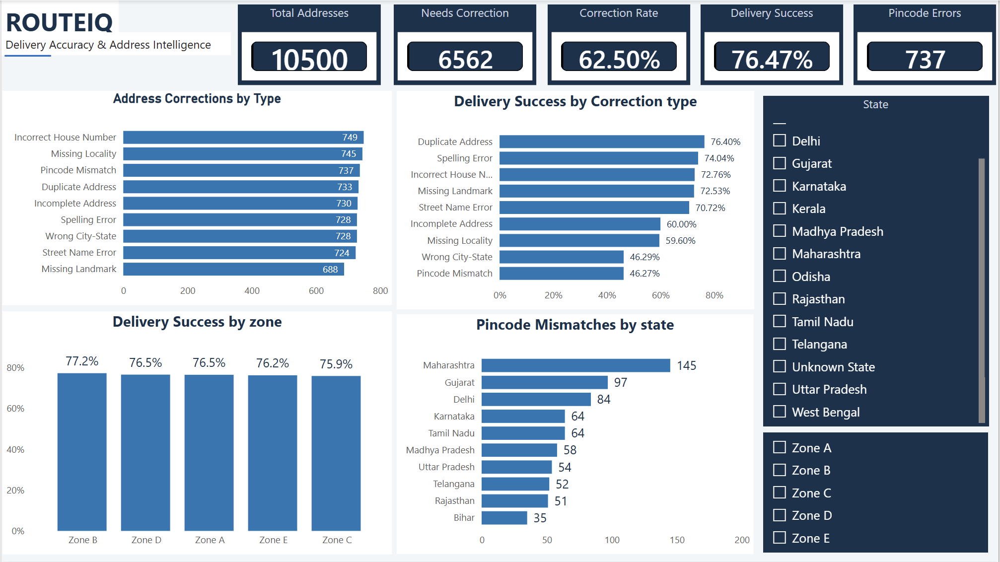

# RouteIQ — Address Data Quality & Delivery Performance Analytics

## Overview

RouteIQ is an end-to-end data analytics project focused on analyzing address data quality and its impact on delivery performance.

The project combines SQL, Python, and Power BI to identify address-related issues, analyze delivery trends, and generate actionable business insights.

## Business Problem

Poor address quality can lead to delivery failures, incorrect routing, and operational inefficiencies.

This project analyzes address correction patterns and delivery outcomes to understand:
- Which address issues occur most frequently
- Which correction types have the highest delivery success rates
- How delivery performance changes over time
- Which zones and locations require attention
- Which correction sources are most effective

## Tools & Technologies

- SQL
- Python
- Pandas
- NumPy
- Matplotlib
- Power BI
- DAX
- CSV

## Project Structure

- `charts/` — Analytical charts and visualizations
- `data/` — Dataset and data generation scripts
- `exports/` — Analysis outputs and summary reports
- `powerbi/` — Power BI dashboard screenshots, DAX measures, and dashboard demos
- `python/` — Python analysis workflow
- `sql/` — Database schema and analysis queries

## Key Analysis Areas

- Address Correction Analysis
- Delivery Success Rate
- Zone Performance
- Monthly Delivery Trends
- Correction Source Effectiveness
- Pincode and Location Analysis

## Dashboard

The Power BI dashboard provides an interactive view of address quality and delivery performance, including KPI metrics, correction analysis, trends, and geographic filters.

### Detailed Analysis Dashboard

[View Detailed Dashboard →](powerbi/RouteIQ-Detailed-Analysis.png)

## Project Outcome

The analysis helps identify major address-quality problems and areas where corrective actions can improve delivery success and operational performance.
